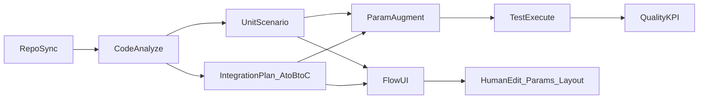

# Platform Overview — 종단 흐름 · Capability 맵

색인: [`docs/index.md`](../index.md)  
제품: [`docs/product/00_NORTH_STAR.md`](../product/00_NORTH_STAR.md)

---

## 1. 종단 흐름



---

## 2. SDD 실행 파이프라인

```text
사용자/UI 요청
  → Router (intent · workflow 후보)
  → Planner (required_capabilities ↔ Skill Hub)
  → Validator
  → Plan JSON
  → Plan Execution Graph (code runtime)
  → Agent Adapter → Skill Tool script
  → Reviewer → Reducer → Response
```

관리형 Hub는 **Workflow Hub + Skill Hub**만이다.
Graph는 코드 Runtime이다.

---

## 3. Capability 맵 (초안)

| capability_id | 역할 | 주요 산출 |
|---|---|---|
| `TEST.REPO.SYNC` | 저장소 엔드포인트 연결·동기화 | `repo_snapshot` |
| `TEST.CODE.ANALYZE` | 코드/주석/의존 신호 분석 | `code_analysis` |
| `TEST.SCENARIO.UNIT_GENERATE` | 단위 시나리오 초안 | `unit_scenarios` |
| `TEST.SCENARIO.INTEGRATION_PLAN` | A→B→C 통합 Plan | `integration_plan` |
| `TEST.PARAM.AUGMENT` | INPUT 생성·증강 | `test_inputs` |
| `TEST.RUN.EXECUTE` | 시나리오 실행 · 통합 FE는 Vercel MCP(DOM·스크린샷) | `run_results` (+ screenshots/DOM 관측) |
| `TEST.FLOW.COMPOSE` | FLOW 그래프 조립 | `flow_graph` |
| `TEST.QUALITY.KPI` | 성공/실패·품질지표 · evidence 연결 | `quality_kpi` |

Workflow는 Skill/Agent 이름을 직접 고정하지 않고
`required_capabilities`로만 선언한다.

---

## 4. Artifact 경계 (개념)

```text
repo_snapshot
  → code_analysis
  → unit_scenarios / integration_plan
  → test_inputs
  → run_results  (+ fe_dom_observations · screenshots — 통합 FE)
  → quality_kpi
  → flow_graph  (UI 편집 가능; 사람 수정분은 별도 revision)
```

없는 값은 추정하지 않고 `missing_data`로 표시한다.
통합 FE 검증 계약: [`.cursor/rules/02-test-automation-domain.mdc`](../../.cursor/rules/02-test-automation-domain.mdc) §5.1

---

## 5. HITL

| AI | 사람 |
|---|---|
| 시나리오·Plan·INPUT 초안 | 시나리오 채택·수정 |
| 실행 결과·관측 로그 요약 | **Pass/Fail 최종 확정** |
| FLOW 배치 제안 | 배포·승인·외부 제출 |

---

## 6. 관련 표준

- Agent: [`../standards/AGENT_RUNTIME.md`](../standards/AGENT_RUNTIME.md)
- Backend: [`../standards/BACKEND_STRUCTURE.md`](../standards/BACKEND_STRUCTURE.md)
- Frontend FLOW: [`../standards/FRONTEND_FLOW_UI.md`](../standards/FRONTEND_FLOW_UI.md)
- 결정: [`DECISIONS.md`](./DECISIONS.md)
