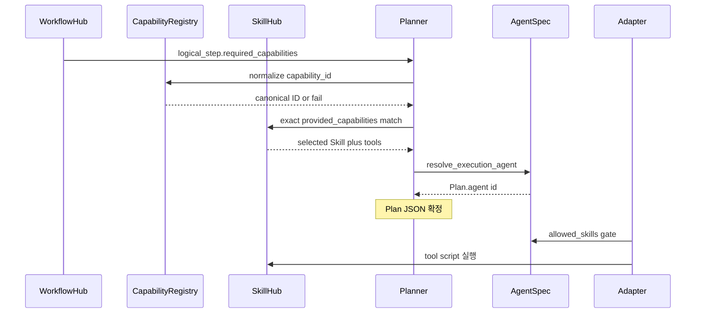

# Hub · Capability · AgentSpec

색인: [`../index.md`](../index.md)

---

## Hub vs 비-Hub

| 자산 | Hub? | 누가 고치나 |
|---|---|---|
| `workflow_definitions/*.yml` | **예** | 업무 목표·단계·intent |
| `skills/*/SKILL.md` | **예** | capability·tool 계약 |
| `capability_definitions/*.yml` | 아니오 | 플랫폼 — 신규 capability_id |
| `agents/specs/*.yml` | 아니오 | 플랫폼 — 허용 Skill·금지 행위 |
| `agents/*/agent.py` | 아니오 | 개발 — thin wrapper |

Catalog/멘션/Draft에 올리는 업무 자산은 Hub 2개뿐이다.

---

## Capability 매칭 흐름

---

## 규칙

- alias는 정규화용이며 실행 기준이 아니다.
- parent capability만 일치하면 자동 실행하지 않는다.
- 경쟁 Skill은 `selectors` / `priority`로 결정론 선택 (LLM 미사용).
- few-shot: [`../work-orders/few-shot/`](../work-orders/few-shot/)
